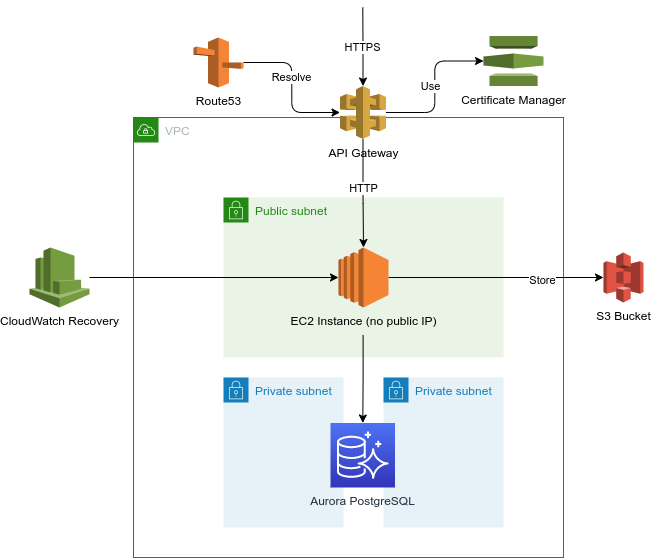
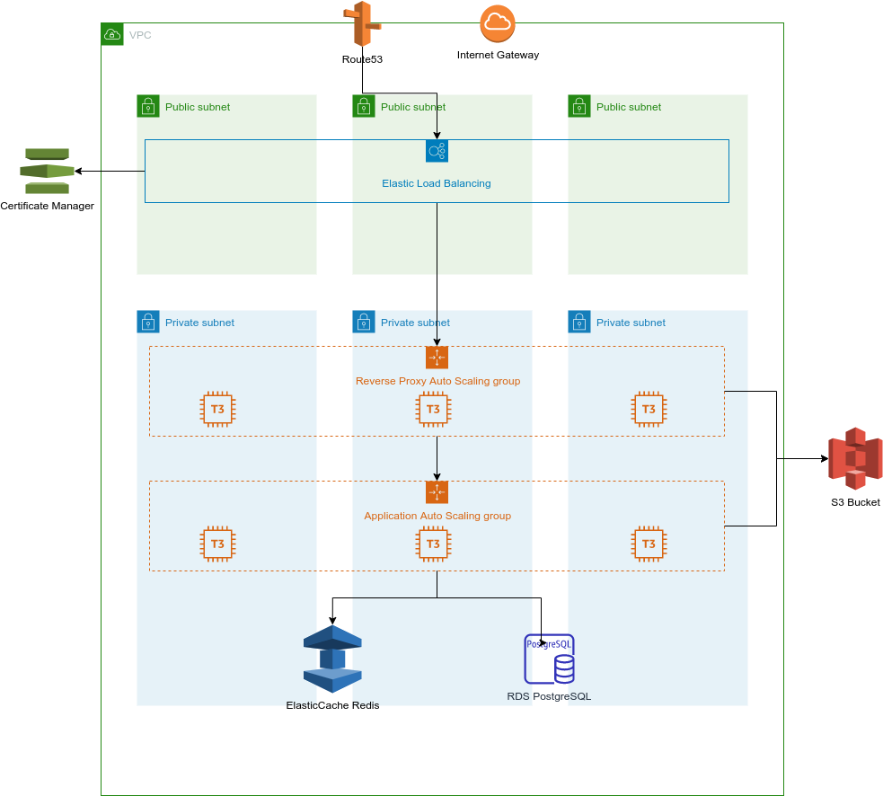

# Diaspora on AWS
This project contains the resources necessary to spin up a [diaspora*](https://diasporafoundation.org/) pod, along with
all the resources needed, in AWS. It aims to provide a cost effective yet reliable infrastructure.
Due to the wide range of cost and reliability requirements, we can think of two possible architectures. One focused on
high reliability, and the other one focused on low cost.

It should be noted that, even though there are other *diaspora forks supporting Docker installations, this repo is based
on the original installation instructions.

# Low Cost Alternative
This is a simpler, low-cost architecture. While it still provides a reliable setup, it does not implement any high
availability features and downtime or low performance are possible. The advantage is that this stack can be run for less
than $20/month in Ireland (eu-west-1).

Please refer to the following [AWS Pricing Calculator estimate](https://calculator.aws/#/estimate?id=1966a424bb82d72b8f68622697035a8aab7428ed).

## Architecture


Even though this solution is aimed at providing a low-cost alternative, it still keeps reliability and low-friction in
mind. It is based around the following components.

### VPC
The stack is deployed in a VPC with a public subnet, where the pod runs, and a private subnet, where a single-AZ RDS
database is hosted. In order to save costs on Load Balancers, this pod runs directly in a public subnet, relying on
a security group to only allow SSH from the VPC (using a bastion host). Only web traffic ports are open to public.

### Pod Autoscaling Group
This contains one instance running an AMI with all [components](https://wiki.diasporafoundation.org/Diasporas_components_explained)
installed, except database. Running in ASG provides higher availability as the ASG will restart failed instances. As
we keep a maximum of 1 instance running, rolling updates will incur in downtime: first the current instance is
terminated and then a new instance is created. This is intentional, as it is currently not known if different versions
of *diaspora could run in parallel, especially during DB migrations.

The instances in this ASG auto-register with an Elastic IP at startup, waiting for this EIP to become available. This
approach is cheaper than running with a load balancer in front of the load balancer.

### Certificate Manager
Certificate Manager to obtain a TLS certificate for the web server.

### S3 Bucket
This bucket to host assets as explained in the diaspora* documentation on [hosting assets on S3](https://wiki.diasporafoundation.org/Asset_hosting_on_S3).

### Aurora PostgreSQL
This PostgreSQL on Aurora database runs in private subnets. It is a serverless database, which reduces cost by only
paying for the periods of usage.

## Installation

First install Packer as mentioned in the [official docs](https://www.packer.io/docs/install).

Create an AWS user for Packer with the [minimal est of permissions necessary](https://www.packer.io/docs/builders/amazon#iam-task-or-instance-role)
and configure it on your terminal ([named profiles](https://docs.aws.amazon.com/cli/latest/userguide/cli-configure-profiles.html)
recommended). After that run (with your profile name) to enable it:

```
export AWS_PROFILE=packer
```

Create the AMI you will use for your pod. Replace `<base_ami_id>` and `<aws_region>` with your base AMI and region. The
scripts have been tested on Ubuntu 20.04 in eu-west-1.

```
cd low_cost/packer
packer build -var ami_id=<base_ami_id> -var region=<aws_region> packer_pod.json
```

If you want to re-create the AMI for a given version and delete any existing resources run:

```
packer build -var ami_id=<base_ami_id> -var region=<aws_region> -force_deregister -force_delete_snapshot packer_pod.json
```

Create parameters using [SSM Parameter Store](https://docs.aws.amazon.com/systems-manager/latest/userguide/systems-manager-parameter-store.html)
for database username and password. Use `SecureString` as the type for the password parameter. You can choose your own
parameter names, as these will be used later when spinning up the CloudFormation Stack.

To create the CloudFormation stack, go to the [CloudFormation Console](https://eu-west-1.console.aws.amazon.com/cloudformation/home)
and create a new stack using the `cf_template.yml` template provided.


## Update
TODO: [Database replacement](https://docs.aws.amazon.com/AWSCloudFormation/latest/UserGuide/aws-resource-rds-dbcluster.html)


# High Availability Alternative
*NOTE: This is a draft diagram with some initial ideas, no work has been carried out to deploy a reliable solution*

