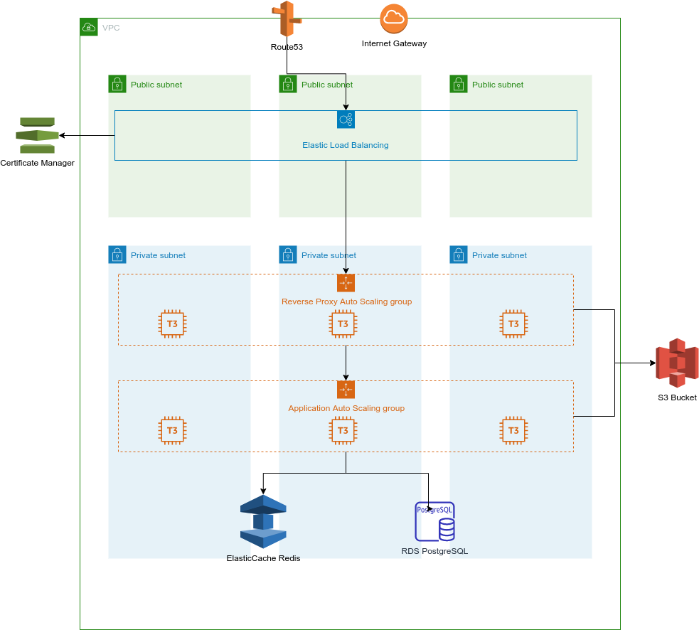

# Diaspora on AWS
This project contains the resources necessary to spin up a [diaspora*](https://diasporafoundation.org/) pod, along with
all the resources needed, in AWS. It aims to provide a cost effective yet reliable infrastructure.

## Architecture
Due to the wide range of cost and reliability requirements, we can think of two possible architectures. One focused on
high reliability, and the other one focused on low cost.

### Low-cost
We'll start with the simpler, low-cost architecture. While it still provides high availability, rolling updates require
downtime. The advantage is that this stack can be run for less than $20/month in Ireland (eu-west-1).

Please refer to the following [AWS Pricing Calculator estimate](https://calculator.aws/#/estimate?id=1966a424bb82d72b8f68622697035a8aab7428ed).

Even though this solution is aimed at providing a low-cost alternative, it still keeps reliability and low-friction in
mind. It is based around the following components.

#### VPC
The stack is deployed in a VPC with a public subnet, where the pod runs, and a private subnet, where a single-AZ RDS
database is hosted. In order to save costs on Load Balancers, this pod runs directly in a public subnet, relying on
a security group to only allow SSH from the VPC (using a bastion host). Only web traffic ports are open to public.

#### Pod Autoscaling Group
This contains one instance running an AMI with all [components](https://wiki.diasporafoundation.org/Diasporas_components_explained)
installed, except database. Running in ASG provides higher availability as the ASG will restart failed instances.

#### Certificate Manager
Certificate Manager to obtain a TLS certificate for the web server.

#### S3 Bucket
This bucket to host assets as explained in the diaspora* documentation on [hosting assets on S3](https://wiki.diasporafoundation.org/Asset_hosting_on_S3).

#### Aurora PostgreSQL
This PostgreSQL on Aurora database runs in private subnets. It is a serverless database, which reduces cost by only
paying for the periods of usage.

### Reliable
*NOTE: This is a draft diagram*

